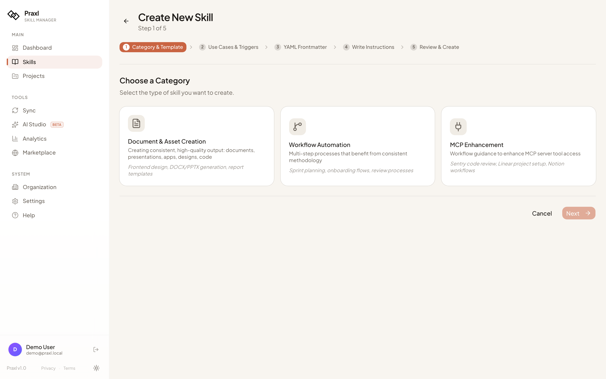
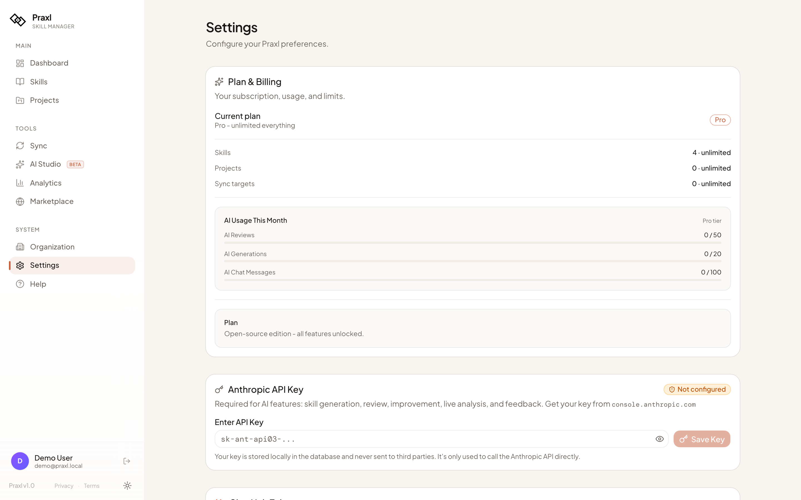

<div align="center">

<picture>
  <source media="(prefers-color-scheme: dark)" srcset="public/logo-dark.png" />
  <source media="(prefers-color-scheme: light)" srcset="public/logo-light.png" />
  
</picture>

# Praxl

### The open-source AI skill manager

Manage, version, and deploy SKILL.md files across all your AI coding tools.<br/>
Write once, synced everywhere.

[](LICENSE)
[](https://www.npmjs.com/package/praxl-app)

[Website](https://praxl.app) · [Documentation](https://praxl.app/docs) · [Self-Host Guide](#-quick-start) · [Contributing](#-contributing)

---

**Deploy with your AI agent:** Copy [SETUP-WITH-AI.md](SETUP-WITH-AI.md) into Claude Code, Cursor, or Copilot.<br/>Non-technical? Just paste the prompt and your AI sets everything up.

</div>

## The Problem

You write a great prompt for Claude Code. It works perfectly. Next session - gone. You rewrite it in Cursor. Slightly different. Your teammate writes a third version.

**SKILL.md files** fix this - persistent instructions that AI tools load automatically. But managing them across tools is chaos.

## How Praxl Fixes It

```
┌─────────────┐
│   Praxl      │──── Edit skill in browser or locally
│  Dashboard   │
└──────┬───────┘
       │ sync
       ├──────────── ~/.claude/skills/      → Claude Code
       ├──────────── ~/.cursor/skills/      → Cursor
       ├──────────── ~/.agents/skills/      → Codex CLI & Copilot
       ├──────────── ~/.windsurf/skills/    → Windsurf
       ├──────────── ~/.opencode/skills/    → OpenCode
       ├──────────── ~/.openclaw/skills/    → OpenClaw
       └──────────── ~/.claude/skills/      → Gemini CLI
```

One edit in Praxl deploys to **9 AI tools** simultaneously.

## Features

```
┌────────────────────────────────────────────────────────────┐
│                                                            │
│   SKILLS          SYNC           AI            TEAM        │
│                                                            │
│   Create          9 tools        Review        Workspaces  │
│   Version         Bidirectional  Generate      Roles       │
│   Tag             CLI daemon     Chat          Share       │
│   Search          Assignments    Score 5dim    Invite      │
│   Import/Export   Deploy         Improve       Copy        │
│   Security scan   Change req     BYO key       Analytics   │
│   Monaco editor   Track usage    Suggest       GDPR        │
│                                                            │
│   MARKETPLACE          REFERENCE FILES                     │
│                                                            │
│   GitHub creators      Scripts                             │
│   ClawHub (13,700+)    Templates                           │
│   One-click install    Assets                              │
│   Security preview     Monaco editor                       │
│                                                            │
└────────────────────────────────────────────────────────────┘
```

## Demo


*Browse the skill library, click a skill, and the Monaco editor opens with AI assistant, security scanner, and version history side-by-side.*


*Live-edit a skill in Monaco. Changes save with one click — versioned, diffable, rollbackable.*


*Search 13,700+ community skills from ClawHub. Filter, preview, install with one click.*


*`praxl scan` discovers all your existing SKILL.md files across Claude Code, Cursor, Codex, and 6 more tools — and scores each on quality + security in one pass.*

## Screenshots


*Dashboard with stats, quick actions, and recent activity.*


*Skill library with search, tags, version, and inline preview.*


*Monaco-powered skill editor with syntax highlighting, AI assistant, security scanner, and one-click deploy.*


*Browse 13,700+ community skills via ClawHub integration.*


*5-step skill creation wizard — category, use cases, frontmatter, content, review.*


*AI-powered skill generation, batch review, and chat. Bring your own Anthropic key or set a server-wide one.*


*Sync skills to Claude Code, Cursor, Codex, Copilot, Windsurf, OpenCode, OpenClaw, Gemini CLI, and Claude.ai via the praxl-app CLI.*


*Plan & billing, AI usage tracking, Anthropic API key configuration. All features unlocked on self-host.*

## Quick Start

### Option 1: Docker (recommended)

```bash
git clone https://github.com/AdamBartkiewicz/praxl-oss.git
cd praxl-oss
cp .env.example .env

# Generate a secret and paste into .env as AUTH_SECRET
openssl rand -base64 32

# Start
docker compose up -d
```

Open **http://localhost:3000** and create your account.

> **Using an AI agent?** Copy [SETUP-WITH-AI.md](SETUP-WITH-AI.md) into your AI tool - it handles everything step by step.

### Option 2: Manual

```bash
git clone https://github.com/AdamBartkiewicz/praxl-oss.git
cd praxl-oss && npm install
cp .env.example .env
# Set DATABASE_URL and AUTH_SECRET in .env
npm run dev
```

### Post-install: Set up admin

```bash
# Get your user ID after signing up
docker compose exec db psql -U praxl -d praxl -c "SELECT id, email FROM users;"

# Add to .env (only ONE line, server-side check via /api/auth/me)
ADMIN_USER_IDS=your-user-id-here

# Recreate the container so the new env var is loaded.
# (NOT `restart` — restart keeps the old environment.)
docker compose up -d --force-recreate app
```

## CLI

```bash
npm install -g praxl-app

# Connect to your instance
praxl connect --url http://localhost:3000

# Or just scan local skills (no account needed)
praxl scan
```

```
┌─── What the CLI does ──────────────────────────────────┐
│                                                        │
│  praxl scan       Discover SKILL.md files + score      │
│  praxl connect    Auth → import → sync → watch         │
│  praxl status     Account info and skill list          │
│                                                        │
│  Background:                                           │
│  • Syncs bidirectionally (cloud ↔ local)               │
│  • Tracks Claude Code usage from session logs          │
│  • Detects local changes and submits as change reqs    │
│                                                        │
└────────────────────────────────────────────────────────┘
```

## Architecture

```
praxl-oss/
│
├── src/app/                    Next.js pages + 40 API routes
│   ├── skills/                 Skill CRUD, editor, detail
│   ├── projects/               Skill grouping
│   ├── sync/                   Platform deployment
│   ├── ai-studio/              AI review + generation
│   ├── marketplace/            Browse + install skills
│   ├── org/                    Team management
│   ├── analytics/              Usage metrics
│   ├── settings/               Config + API keys
│   ├── admin/                  Admin panel
│   └── api/
│       ├── auth/               JWT login/register/logout
│       ├── cli/                CLI communication (10 endpoints)
│       ├── ai/                 Anthropic proxy + chat
│       ├── clawhub/            ClawHub integration
│       └── trpc/               tRPC handler
│
├── src/server/routers/         Business logic (10 routers)
│   ├── skills.ts               824 lines - skill CRUD, sharing, versioning
│   ├── sync.ts                 801 lines - multi-platform deployment
│   ├── ai.ts                   972 lines - AI review, generation, marketplace
│   ├── org.ts                  320 lines - teams & organizations
│   ├── analytics.ts            275 lines - usage analytics
│   └── ...                     chat, files, settings, projects, GDPR
│
├── src/db/schema.ts            20 PostgreSQL tables
├── src/lib/auth/               JWT + bcrypt (no external service)
├── docker-compose.yml          One-command setup
└── SETUP-WITH-AI.md            AI agent deployment guide
```

**Tech stack:**

| Layer | Technology |
|-------|-----------|
| Framework | Next.js 16 (App Router) |
| API | tRPC (type-safe, 100+ procedures) |
| Database | PostgreSQL + Drizzle ORM |
| Auth | Built-in JWT + bcrypt |
| AI | Anthropic Claude (optional) |
| UI | Tailwind CSS + shadcn/ui |
| Editor | Monaco (VS Code engine) |

## Self-Hosting vs Cloud

|  | Self-Hosted | Cloud (go.praxl.app) |
|---|---|---|
| **Price** | Free forever | Free tier / $5/mo Pro |
| **Features** | All unlocked | Limits on Free, all on Pro |
| **AI** | BYO Anthropic key | Included (no key needed) |
| **Auth** | Email/password | Google, GitHub SSO |
| **Hosting** | You manage | Managed |
| **Data** | Your server | Our cloud |
| **Updates** | `git pull` | Automatic |

## Environment Variables

| Variable | Required | Description |
|----------|:--------:|-------------|
| `DATABASE_URL` | **Yes** | PostgreSQL connection string |
| `AUTH_SECRET` | **Yes** | JWT secret. Generate: `openssl rand -base64 32` |
| `NEXT_PUBLIC_APP_URL` | No | Your URL (default: `http://localhost:3000`) |
| `ADMIN_USER_IDS` | No | Comma-separated admin user IDs |
| `ANTHROPIC_SERVER_KEY` | No | Anthropic key for server-side AI |
| `ENCRYPTION_KEY` | No | Encrypt stored API keys. Generate: `openssl rand -hex 32` |
| `GITHUB_TOKEN` | No | GitHub PAT for marketplace indexing |
| `CRON_SECRET` | No | Auth token for cron endpoints |

## AI Features

AI features require an Anthropic API key. Two modes:

```
Mode 1: Users bring their own key
  → Each user enters key in Settings
  → Stored encrypted in database
  → User pays Anthropic directly

Mode 2: Server provides a key
  → Set ANTHROPIC_SERVER_KEY in .env
  → All users get AI without configuring anything
  → You pay the Anthropic bill
```

Without any key, the app works fine - AI features are simply not available.

## Contributing

We welcome contributions! See [CONTRIBUTING.md](CONTRIBUTING.md).

```bash
git clone https://github.com/AdamBartkiewicz/praxl-oss.git
cd praxl-oss && npm install
cp .env.example .env  # Configure DATABASE_URL + AUTH_SECRET
npm run dev
```

### Help wanted

- **Auth adapters** - NextAuth.js, Lucia, OAuth providers
- **AI providers** - OpenAI, Ollama, local LLM support
- **Platform detection** - Usage tracking for Cursor, Copilot, etc.
- **Tests** - Unit and integration tests
- **Documentation** - Guides, tutorials, translations
- **UI/UX** - Accessibility, mobile, dark mode improvements

## FAQ

<details>
<summary><strong>Do I need an Anthropic API key?</strong></summary>
<br/>
No. The app works without it - you just won't have AI features (review, generation, chat). Everything else works: editing, versioning, sync, teams, marketplace.
</details>

<details>
<summary><strong>Can I use this with my team?</strong></summary>
<br/>
Yes. Create an organization, invite members by email. Share skills to the org workspace. All unlocked on self-hosted - no plan limits.
</details>

<details>
<summary><strong>How is this different from managing .md files in git?</strong></summary>
<br/>
Git manages files. Praxl manages skills - it knows SKILL.md structure, reviews quality with AI, deploys to the right directories for each tool, tracks which skills get used, and gives you a visual editor with version diffs.
</details>

<details>
<summary><strong>What's a SKILL.md file?</strong></summary>
<br/>
A Markdown file with YAML frontmatter that AI tools load as persistent instructions. Claude Code reads from <code>~/.claude/skills/</code>, Cursor from <code>~/.cursor/skills/</code>, etc. Write once, loaded in every session.
</details>

<details>
<summary><strong>Is my data safe?</strong></summary>
<br/>
On self-hosted: your data never leaves your server. API keys encrypted with AES-256-GCM. GDPR tools built in (data export, account deletion). No telemetry, no tracking, no data sent to third parties.
</details>

<details>
<summary><strong>Can I deploy this for my company?</strong></summary>
<br/>
Yes. AGPL-3.0 allows commercial use and self-hosting. If you modify the code and offer it as a hosted service to others, you must open-source your changes. Internal company use with modifications is fine.
</details>

## License

[AGPL-3.0](LICENSE) - Use, modify, self-host freely. Distribute as a service → open-source your changes.

---

<div align="center">

**[Star this repo](https://github.com/AdamBartkiewicz/praxl-oss)** if you find it useful

Built by [Adam Bartkiewicz](https://github.com/AdamBartkiewicz) · [praxl.app](https://praxl.app)

</div>
