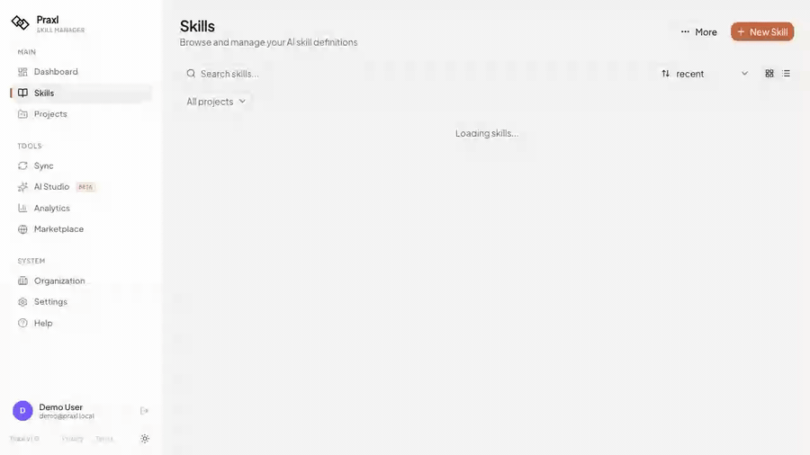
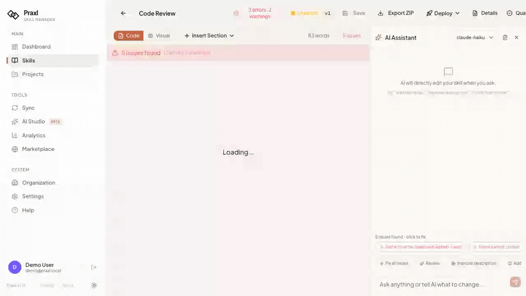
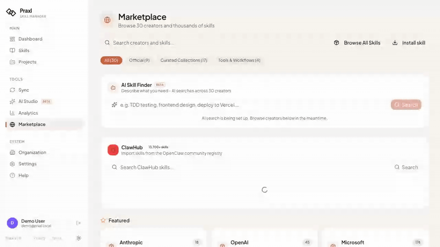
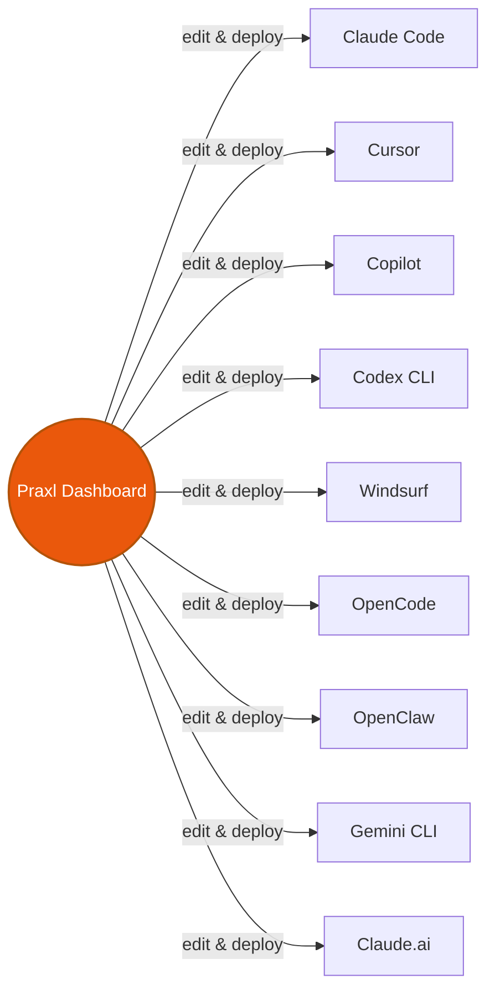
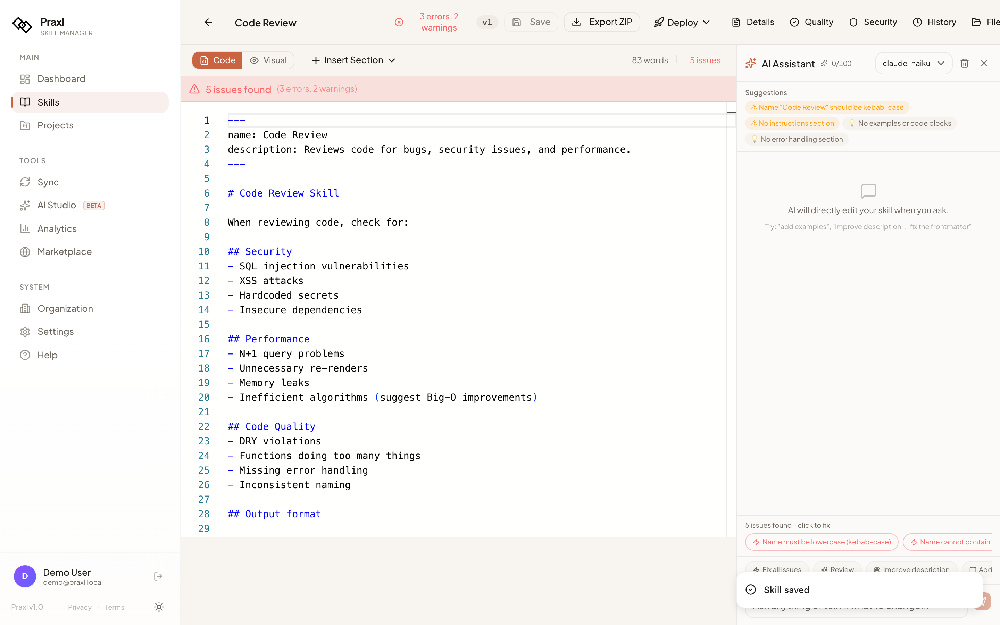
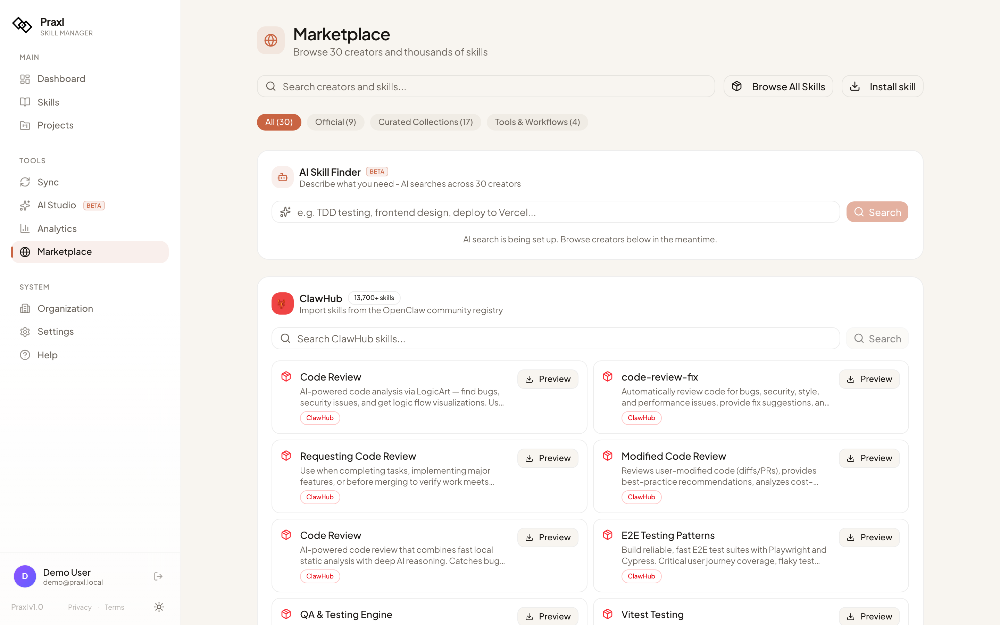
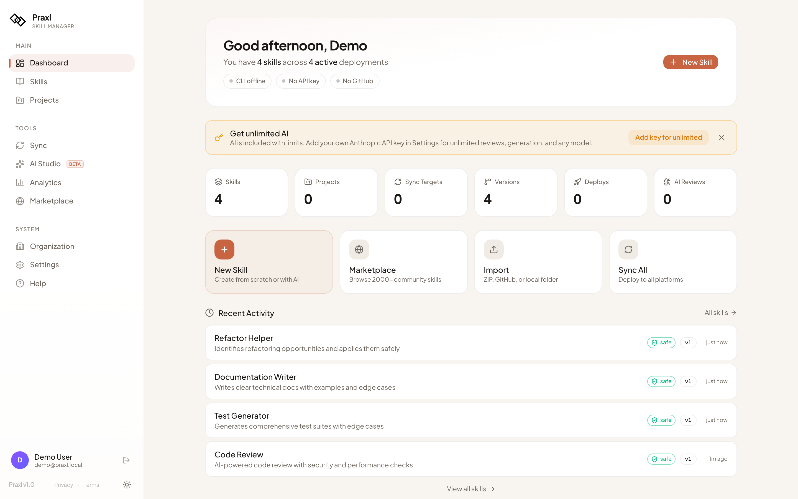
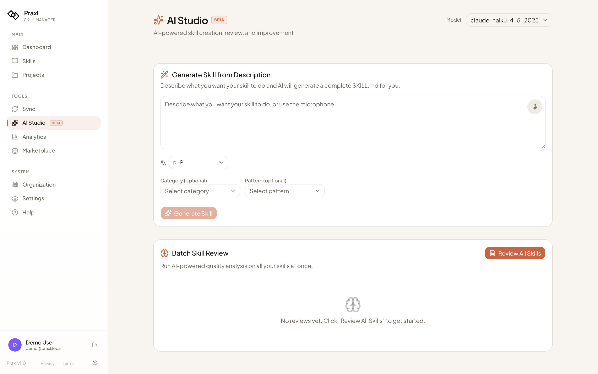
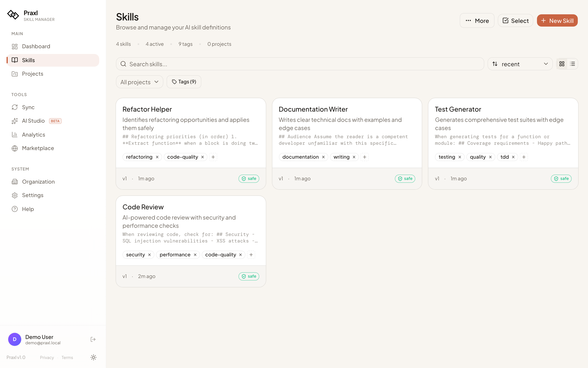
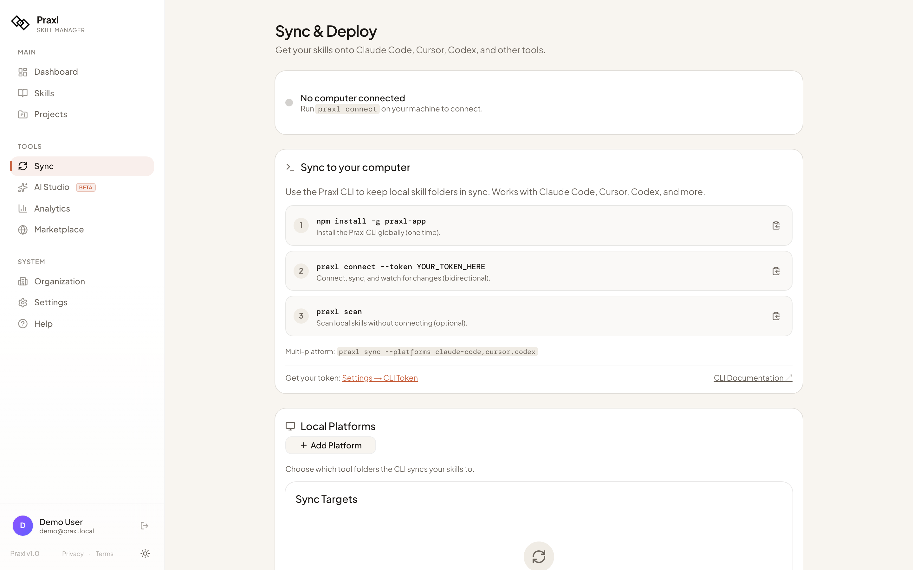

<div align="center">

<picture>
  <source media="(prefers-color-scheme: dark)" srcset="public/logo-dark.png" />
  <source media="(prefers-color-scheme: light)" srcset="public/logo-light.png" />
  
</picture>

# Praxl

### The open-source AI skill manager

Manage, version, and deploy SKILL.md files across all your AI coding tools.<br/>
Write once, synced everywhere.

[](LICENSE)
[](https://www.npmjs.com/package/praxl-app)
[](https://www.npmjs.com/package/praxl-app)
[](https://github.com/AdamBartkiewicz/praxl-oss/stargazers)
[](https://github.com/AdamBartkiewicz/praxl-oss/commits)
[](https://github.com/AdamBartkiewicz/praxl-oss)

[Website](https://praxl.app) · [Documentation](https://praxl.app/docs) · [Quick Start](#-quick-start) · [Discussions](https://github.com/AdamBartkiewicz/praxl-oss/discussions) · [Contributing](#-contributing)

</div>

## Demo


*52-second walk-through — browse the skill library, edit a skill in Monaco, search the community marketplace, and discover existing skills with the CLI. ([Watch in higher quality (MP4, 2.9 MB)](docs/demos/praxl-demo.mp4))*

<details>
<summary><b>📺 Individual demos (click to expand)</b></summary>

<br/>

**1. Browse and open the editor**



Browse the skill library, click a skill, and the Monaco editor opens with the AI assistant, security scanner, and version history side-by-side.

---

**2. Live edit and save**



Live-edit a skill in Monaco. Changes save with one click — versioned, diffable, rollbackable.

---

**3. Browse the marketplace**



Search 13,700+ community skills from ClawHub. Filter, preview, install with one click.

---

**4. CLI scan**


`praxl scan` discovers all your existing SKILL.md files across Claude Code, Cursor, Codex, and 6 more tools — and scores each on quality + security in one pass.

</details>

## Try it now

```bash
# Discover the skills you already have (no signup, no install of the full app)
npx praxl-app scan

# Or self-host the full Praxl in 5 minutes (macOS / Linux)
git clone https://github.com/AdamBartkiewicz/praxl-oss.git
cd praxl-oss
cp .env.example .env
sed -i.bak "s|^AUTH_SECRET=.*|AUTH_SECRET=$(openssl rand -base64 32)|" .env && rm .env.bak
docker compose up -d --build
# Wait ~2 minutes for build + db init, then visit http://localhost:3000
```

> 🪄 **Or paste a single prompt** into Claude Code / Cursor and have your AI agent deploy it for you. See [SETUP-WITH-AI.md](SETUP-WITH-AI.md).

## The Problem

You write a great prompt for Claude Code. Next session — gone. You rewrite it in Cursor. Slightly different. Your teammate writes a third version. **SKILL.md files** fix this — but managing them across 9 AI tools is chaos.

## How it works



One edit in Praxl deploys to **9 AI tools** simultaneously. The CLI runs as a background daemon, syncing bidirectionally — edit in the browser or locally, both sides stay in sync.

## App Preview

<table>
  <tr>
    <td align="center"><b>Skill Editor</b></td>
    <td align="center"><b>Community Marketplace</b></td>
  </tr>
  <tr>
    <td></td>
    <td></td>
  </tr>
  <tr>
    <td align="center"><b>Dashboard</b></td>
    <td align="center"><b>AI Studio</b></td>
  </tr>
  <tr>
    <td></td>
    <td></td>
  </tr>
  <tr>
    <td align="center"><b>Skill Library</b></td>
    <td align="center"><b>Multi-Tool Sync</b></td>
  </tr>
  <tr>
    <td></td>
    <td></td>
  </tr>
</table>

## Features

<table>
  <tr>
    <td valign="top" width="33%">
      <h3>📝 Skills</h3>
      <ul>
        <li>Create, edit, version with diffs</li>
        <li>Tag, search, filter</li>
        <li>Reference files (scripts, templates, assets)</li>
        <li>Monaco editor with syntax highlight</li>
        <li>Import / export, full history</li>
        <li>Security scanning on every save</li>
      </ul>
    </td>
    <td valign="top" width="33%">
      <h3>🔄 Sync</h3>
      <ul>
        <li>9 AI tools out of the box</li>
        <li>Bidirectional CLI daemon</li>
        <li>Per-tool skill assignments</li>
        <li>PR-style change requests</li>
        <li>Track which skills get loaded</li>
        <li>One-click deploy + rollback</li>
      </ul>
    </td>
    <td valign="top" width="33%">
      <h3>🤖 AI Studio</h3>
      <ul>
        <li>5-dimension quality review</li>
        <li>Generate from a description</li>
        <li>Chat with your skill library</li>
        <li>Auto-improve suggestions</li>
        <li>BYO Anthropic key or server-shared</li>
        <li>Streaming responses</li>
      </ul>
    </td>
  </tr>
  <tr>
    <td valign="top">
      <h3>👥 Teams</h3>
      <ul>
        <li>Org workspaces with roles</li>
        <li>Invite by email</li>
        <li>Share or copy skills</li>
        <li>Org-level analytics</li>
        <li>GDPR data export &amp; deletion</li>
      </ul>
    </td>
    <td valign="top">
      <h3>🛒 Marketplace</h3>
      <ul>
        <li>ClawHub: 13,700+ community skills</li>
        <li>30 GitHub creators indexed</li>
        <li>One-click install with security preview</li>
        <li>AI-powered skill search</li>
        <li>Browse before you commit</li>
      </ul>
    </td>
    <td valign="top">
      <h3>🛡️ Security</h3>
      <ul>
        <li>Two independent validation layers</li>
        <li>AES-256-GCM at rest</li>
        <li>HSTS + CSP + strict cookies</li>
        <li>Audit log for every CLI action</li>
        <li>Open source, fully auditable</li>
      </ul>
    </td>
  </tr>
</table>

## How Praxl compares

Honest comparisons with the strongest open-source competitors. Full per-tool detail at [praxl.app/compare](https://praxl.app/compare/manual-management).

| Tool | Where Praxl wins | Where they win |
|------|-------------------|-----------------|
| [**rulesync**](https://praxl.app/compare/rulesync) (994⭐) | Visual editor, team workspaces, AI quality review, hosted cloud | 27 supported tools (vs 9), zero-infrastructure CLI, daily releases |
| [**skillshare**](https://praxl.app/compare/skillshare) (1.4k⭐) | Bidirectional cloud sync, structural sandbox + opt-in trust paths, team layer | ~500-rule deterministic security audit (deepest in the category), 57 tools |
| [**Manual / git**](https://praxl.app/compare/git-repos) | Auto-deploy to 9 tools, AI scoring, version diffs in UI | Zero dependencies, no server |
| [**Skills Manager**](https://praxl.app/compare/skills-manager) (500⭐) | 9 tools (vs 3 built-in), cloud sync, version history, AI review, teams | Native desktop app, no account needed, MIT license |
| [**.cursorrules**](https://praxl.app/compare/cursorrules) | Beyond a single file per project; modular, reusable, multi-tool | Native Cursor integration, no setup |

The most defensible setup for many teams is **running both** Praxl and skillshare — Praxl for the lifecycle and team layer, skillshare's audit engine for content scanning. We're complementary.

## 🚀 Quick Start

### Option 1: Docker (recommended)

```bash
git clone https://github.com/AdamBartkiewicz/praxl-oss.git
cd praxl-oss
cp .env.example .env

# Generate AUTH_SECRET — works on macOS AND Linux (sed -i.bak is portable)
sed -i.bak "s|^AUTH_SECRET=.*|AUTH_SECRET=$(openssl rand -base64 32)|" .env && rm .env.bak

# Build + start (~2 min first time)
docker compose up -d --build
```

Wait for the migrate container to finish (`docker compose ps` should show `migrate` as `exited (0)`), then open **http://localhost:3000** and create your account.

> 🪄 **Using an AI agent?** Copy [SETUP-WITH-AI.md](SETUP-WITH-AI.md) into Claude Code / Cursor — it handles every step including troubleshooting.

### Option 2: Manual

```bash
git clone https://github.com/AdamBartkiewicz/praxl-oss.git
cd praxl-oss && npm install
cp .env.example .env
# Set DATABASE_URL and AUTH_SECRET in .env
npx drizzle-kit push --force
npm run dev
```

### Post-install: Set up admin

```bash
# Get your user ID after signing up
docker compose exec db psql -U praxl -d praxl -c "SELECT id, email FROM users;"

# Add to .env (one line — server-side check via /api/auth/me)
ADMIN_USER_IDS=your-user-id-here

# Recreate the container so the new env var loads.
# (NOT `restart` — restart keeps the old environment.)
docker compose up -d --force-recreate app
```

## CLI

```bash
npm install -g praxl-app

# Connect to your instance (cloud or self-hosted)
praxl connect --url http://localhost:3000

# Or just scan local skills (no account needed)
praxl scan
```

**What the CLI does:**

- **`praxl scan`** — discovers SKILL.md files across 9 tool directories and scores each one
- **`praxl connect`** — auth, import existing skills, sync bidirectionally, watch for changes
- **`praxl status`** — show your account and skill list
- **`praxl trust-path <dir>`** — opt-in custom skill directories for power users

In the background it tracks usage from Claude Code session logs, detects local edits and submits them as change requests, and writes an audit log to `~/.praxl/audit.log`.

## Tech stack

| Layer       | Technology                          |
|-------------|-------------------------------------|
| Framework   | Next.js 16 (App Router)             |
| API         | tRPC 11 (type-safe, 100+ procedures)|
| Database    | PostgreSQL 16 + Drizzle ORM         |
| Auth        | Built-in JWT + bcrypt (no external) |
| AI          | Anthropic Claude (optional)         |
| UI          | Tailwind CSS 4 + shadcn/ui          |
| Editor      | Monaco (VS Code engine)             |

For the full repository layout, database schema, and contribution patterns, see **[`docs/ARCHITECTURE.md`](docs/ARCHITECTURE.md)**.

## Self-Hosted vs Cloud

|  | Self-Hosted | Cloud (go.praxl.app) |
|---|---|---|
| **Price** | Free forever | Free tier / $5/mo Pro |
| **Features** | All unlocked | Limits on Free, all on Pro |
| **AI** | BYO Anthropic key | Included (no key needed) |
| **Auth** | Email/password | Google, GitHub SSO |
| **Hosting** | You manage | Managed |
| **Data** | Your server | Our cloud |
| **Updates** | `git pull` | Automatic |

## Environment Variables

| Variable | Required | Description |
|----------|:--------:|-------------|
| `AUTH_SECRET` | **Yes** | JWT secret. Generate: `openssl rand -base64 32` |
| `DATABASE_URL` | Yes (manual) | PostgreSQL connection string. Docker auto-injects this. |
| `NEXT_PUBLIC_APP_URL` | No | Your URL (default: `http://localhost:3000`) |
| `ADMIN_USER_IDS` | No | Comma-separated admin user IDs |
| `ANTHROPIC_SERVER_KEY` | No | Anthropic key for server-side AI (Mode 2 below) |
| `ENCRYPTION_KEY` | No | Encrypt stored API keys. Generate: `openssl rand -hex 32` |
| `GITHUB_TOKEN` | No | GitHub PAT for marketplace indexing |
| `CRON_SECRET` | No | Auth token for cron endpoints |

## AI Features

AI features (skill review, generation, chat) need an Anthropic API key. Two modes:

**Mode 1 — Each user provides their own key**
- Each user enters their key in Settings (encrypted at rest with `ENCRYPTION_KEY`)
- They pay Anthropic directly
- Simplest for self-hosters

**Mode 2 — Server provides a shared key**
- Set `ANTHROPIC_SERVER_KEY` in `.env`
- All users get AI without configuring anything
- You pay the Anthropic bill

Without any key, the app works fine — AI buttons just don't appear.

## 💬 Community

- [**GitHub Discussions**](https://github.com/AdamBartkiewicz/praxl-oss/discussions) — questions, ideas, show & tell
- [**GitHub Issues**](https://github.com/AdamBartkiewicz/praxl-oss/issues) — bug reports & feature requests
- [**Help Wanted issues**](https://github.com/AdamBartkiewicz/praxl-oss/issues?q=is%3Aissue+is%3Aopen+label%3A%22help+wanted%22) — good places to start contributing
- 🌐 [**praxl.app**](https://praxl.app) — landing, docs, blog
- ☁️ [**go.praxl.app**](https://go.praxl.app) — managed cloud edition

## 🤝 Contributing

We welcome contributions! See [CONTRIBUTING.md](CONTRIBUTING.md) and [`docs/ARCHITECTURE.md`](docs/ARCHITECTURE.md).

```bash
git clone https://github.com/AdamBartkiewicz/praxl-oss.git
cd praxl-oss && npm install
cp .env.example .env  # Configure DATABASE_URL + AUTH_SECRET
npm run dev
```

### Help wanted

- **Auth adapters** — NextAuth.js, Lucia, OAuth providers
- **AI providers** — OpenAI, Ollama, local LLM support
- **Tool adapters** — broaden the 9-tool list (Cline, Kilo, Roo, JetBrains Junie, etc.)
- **Tests** — unit and integration tests
- **Documentation** — guides, tutorials, translations
- **UI/UX** — accessibility, mobile, dark mode improvements

## FAQ

<details>
<summary><strong>Do I need an Anthropic API key?</strong></summary>
<br/>
No. The app works without it — you just won't have AI features (review, generation, chat). Everything else works: editing, versioning, sync, teams, marketplace.
</details>

<details>
<summary><strong>Can I use this with my team?</strong></summary>
<br/>
Yes. Create an organization, invite members by email, share skills to the org workspace. All unlocked on self-hosted — no plan limits.
</details>

<details>
<summary><strong>How is this different from managing .md files in git?</strong></summary>
<br/>
Git manages files. Praxl manages skills — it knows SKILL.md structure, reviews quality with AI, deploys to the right directories for each tool, tracks which skills get used, and gives you a visual editor with version diffs.
</details>

<details>
<summary><strong>What's a SKILL.md file?</strong></summary>
<br/>
A Markdown file with YAML frontmatter that AI tools load as persistent instructions. Claude Code reads from <code>~/.claude/skills/</code>, Cursor from <code>~/.cursor/skills/</code>, etc. Write once, loaded in every session.
</details>

<details>
<summary><strong>Is my data safe?</strong></summary>
<br/>
On self-hosted: your data never leaves your server. API keys encrypted with AES-256-GCM. GDPR tools built in (data export, account deletion). No telemetry, no tracking, no data sent to third parties. Full security model: <a href="https://praxl.app/security">praxl.app/security</a>
</details>

<details>
<summary><strong>Can I deploy this for my company?</strong></summary>
<br/>
Yes. AGPL-3.0 allows commercial use and self-hosting. If you modify the code and offer it as a hosted service to others, you must open-source your changes. Internal company use with modifications is fine.
</details>

<details>
<summary><strong>Why AGPL-3.0 instead of MIT?</strong></summary>
<br/>
The CLI (<code>praxl-app</code>) is MIT — embed it freely. The server is AGPL-3.0 to protect against being taken and rehosted as a closed-source SaaS competitor without contributing back. If you only run it inside your own org, AGPL is no different from MIT for you.
</details>

## License

[AGPL-3.0](LICENSE) — Use, modify, self-host freely. Distribute as a service → open-source your changes.

The CLI ([`praxl-app` on npm](https://github.com/AdamBartkiewicz/praxl-cli)) is MIT — embed it anywhere.

---

<div align="center">

**[⭐ Star this repo](https://github.com/AdamBartkiewicz/praxl-oss)** if you find it useful

Built by [Adam Bartkiewicz](https://github.com/AdamBartkiewicz) · [praxl.app](https://praxl.app)

</div>
